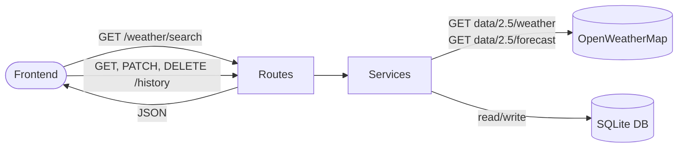

# Backend Architecture

A **FastAPI** REST API that proxies OpenWeatherMap, transforms weather data for the frontend, and persists search history in a SQLite database.

## Stack
- **FastAPI** — web framework
- **SQLAlchemy + SQLite** — database ORM and storage (`weather_history.db`)
- **httpx** — async HTTP client for OWM calls
- **Pydantic** — request/response validation
- **OpenWeatherMap API (v2.5)** — external weather data source

## Request Flow



## API Endpoints

### `GET /weather/search`
Primary search endpoint — fetches both current and forecast, saves to history.

**Request**
| Param | Type | Required | Description |
|---|---|---|---|
| `q` | `string` | Yes | City name, zip code, or `lat,lon` coordinates |

**Response**
```json
{
  "current": {
    "location":        "string",
    "temperature":     "float   (°F)",
    "feels_like":      "float   (°F)",
    "humidity":        "int     (%)",
    "pressure":        "int     (hPa)",
    "wind_speed":      "float   (mph)",
    "wind_deg":        "int?    (degrees)",
    "visibility":      "int?    (metres)",
    "description":     "string",
    "condition_code":  "int     (OWM code)",
    "sunrise":         "int?    (Unix timestamp)",
    "sunset":          "int?    (Unix timestamp)",
    "timezone_offset": "int     (seconds from UTC)"
  },
  "forecast": [
    {
      "date":           "string  (YYYY-MM-DD)",
      "temp_max":       "float   (°F)",
      "temp_min":       "float   (°F)",
      "description":    "string",
      "condition_code": "int     (OWM code)",
      "humidity":       "int     (%)"
    }
  ]
}
```

---

### `GET /history/`
Returns all past searches sorted by search time (newest first).

**Response** — array of history records
```json
[
  {
    "hid":             "int",
    "timestamp":       "string  (local time of searched location)",
    "title":           "string  (location name, user-editable)",
    "query":           "string  (original search input)",
    "current_weather": "object",
    "forecast":        "array"
  }
]
```

---

### `PATCH /history/{hid}`
Rename a history record's title.

**Body** `{ "title": "string" }`
**Response** — updated history record

---

### `DELETE /history/{hid}`
Delete a history record. Returns `204 No Content`.

---

## Key Files

| File | Role |
|---|---|
| `main.py` | App entry point, registers routes, CORS, creates DB tables |
| `app/config.py` | API key, OWM base URL |
| `app/database.py` | SQLAlchemy engine, session, `get_db` dependency |
| `app/models/history.py` | `WeatherHistory` table definition |
| `app/schemas/weather.py` | Pydantic models for weather responses |
| `app/schemas/history.py` | Pydantic models for history records |
| `app/services/weather.py` | OWM API calls and data transformation |
| `app/services/history.py` | Database CRUD operations |
| `app/routes/weather.py` | Weather endpoint handlers |
| `app/routes/history.py` | History endpoint handlers |
