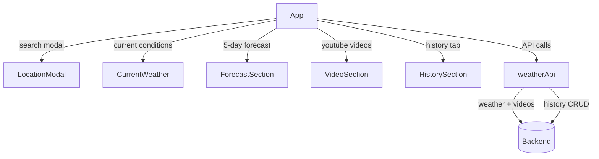

# Frontend

React single-page application for Tom's Weather App.

## How to Run

```bash
yarn install
yarn start
```

Runs at **http://localhost:3000**. Requires the backend running at `http://localhost:8000`.

## Stack

- **React 19** — UI framework
- **Ant Design 6** — component library
- **dayjs** — date handling for the date range picker
- **Create React App** — build tooling

## Components

| Component | Description |
|---|---|
| `App.js` | Root — manages all state, fetches weather + videos in parallel |
| `LocationModal.jsx` | Search modal with City / Zip / GPS / Town tabs + optional date range picker |
| `CurrentWeather.jsx` | Current conditions card (temp, wind, humidity, pressure, visibility, sunrise/sunset) |
| `ForecastSection.jsx` | 5-day forecast cards, correctly labels "Today" by comparing actual date |
| `VideoSection.jsx` | 3 embedded YouTube iframes for the searched location |
| `HistorySection.jsx` | Past searches — expand to see full weather data, rename, delete, export |

## API Calls (`src/utils/weatherApi.js`)

| Function | Method | Endpoint |
|---|---|---|
| `searchWeather(q, startDate, endDate)` | GET | `/weather/search` |
| `fetchVideos(location)` | GET | `/youtube/videos` |
| `fetchHistory()` | GET | `/history/` |
| `updateHistoryTitle(hid, title)` | PATCH | `/history/:hid` |
| `deleteHistoryRecord(hid)` | DELETE | `/history/:hid` |
| `getExportUrl(format)` | — | `/history/export?format=` |

## Component Tree


