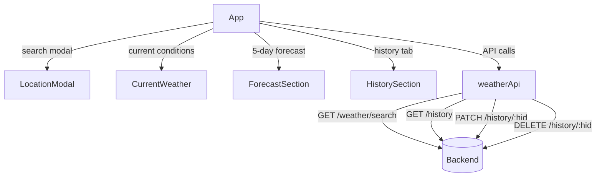

# Frontend Architecture

A React single-page application built with **Ant Design** for UI components. The app fetches weather data and search history from the backend, displaying current conditions, a 5-day forecast, and a searchable history log.

## Stack
- **React 19** — UI framework
- **Ant Design 6** — component library
- **Create React App** — build tooling

## Component Tree

## Key Files

| File | Role |
|---|---|
| `src/App.js` | Root component, holds all state |
| `src/components/LocationModal.jsx` | Search modal — City / Zip / GPS / Town tabs |
| `src/components/CurrentWeather.jsx` | Current weather card |
| `src/components/ForecastSection.jsx` | 5-day forecast cards |
| `src/components/HistorySection.jsx` | Search history list with rename and delete |
| `src/utils/weatherApi.js` | All HTTP calls to the backend |
| `src/utils/weatherIcons.js` | Maps OWM condition codes to emojis |

## API Calls (weatherApi.js)

| Function | Method | Endpoint | Description |
|---|---|---|---|
| `searchWeather(q)` | GET | `/weather/search` | Fetch current + forecast, saves to history |
| `fetchHistory()` | GET | `/history/` | Load all past searches |
| `updateHistoryTitle(hid, title)` | PATCH | `/history/:hid` | Rename a history record |
| `deleteHistoryRecord(hid)` | DELETE | `/history/:hid` | Delete a history record |
